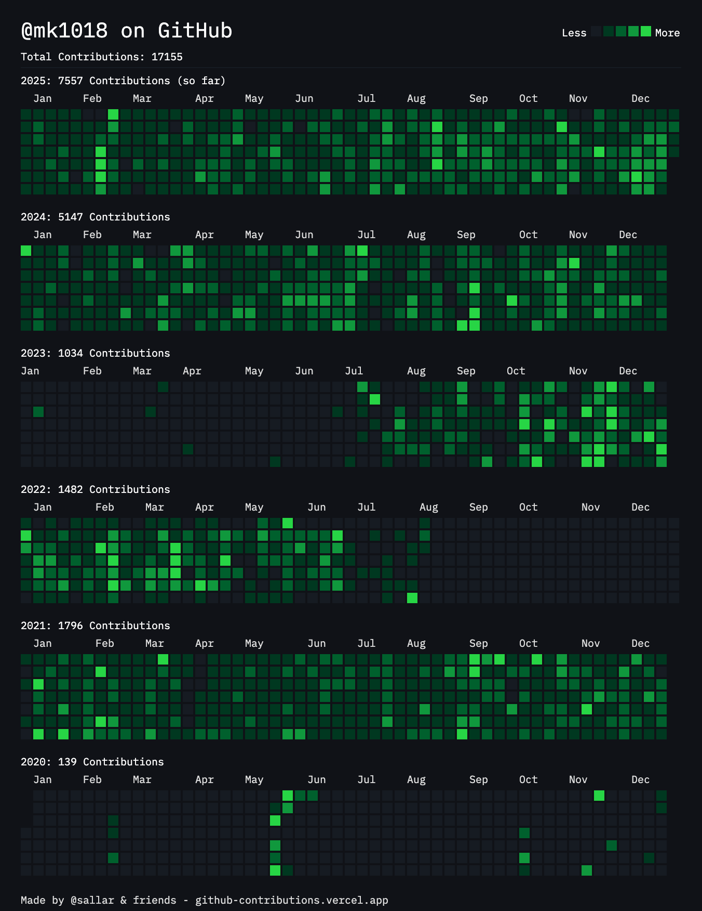

<h1 align="center">
  Motonari Kurita
  <h3 align="center">BlockChain & Web engineer based in Japan.</h3>
</h1>

  

    
     
    
  

  <!--  
     -->

  

  <!-- <picture align="center">
    <source media="(prefers-color-scheme: dark)" srcset="https://github.com/mk1018/mk1018/blob/main/img/snake-dark.svg">
    
  </picture> -->

  
  
  

   

  

    

      Show Contributions(2020 ~ 2024)
    

    
  

